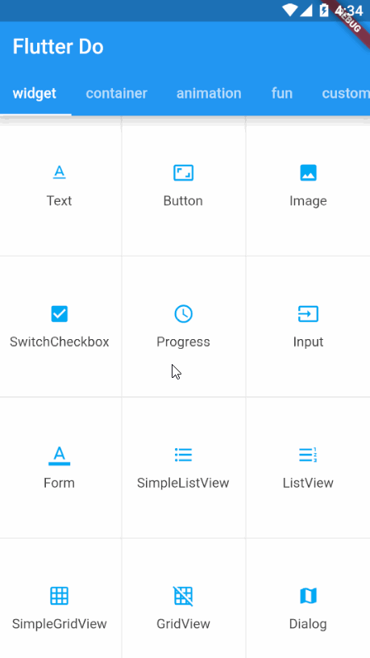
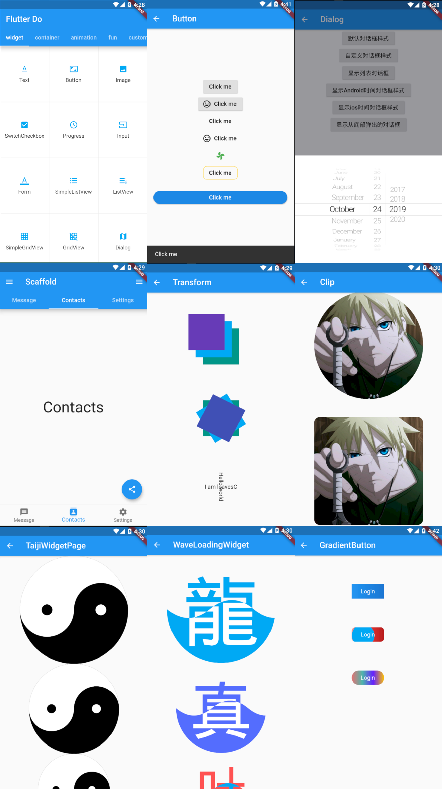

# flutter_do

Basic Flutter apps, for flutter devs.

一个帮助开发者加深了解 Flutter 的项目，提供了 N 多个常用 Widget 和自定义 Widget 的使用及实现方法，涵盖了系统 Widget 、布局容器、动画、高阶功能、自定义 Widget 等内容，即包含如下几个大分类：

- widget
- container
- animation
- fun
- customWidget

点击下载 apk 体验：[flutter_do](release/app-release.apk)

或者扫码下载：

正在密集更新中……